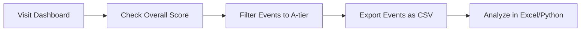
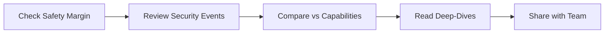
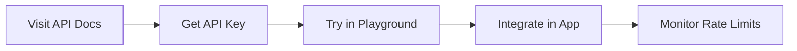

# First Steps

Now that you have the AGI Tracker installed, let's explore the key features and workflows.

## Understanding the Dashboard

When you visit http://localhost:3000, you'll see the main dashboard with several key components:

### 1. Composite AGI Proximity Gauge

The large circular gauge at the top shows the **overall AGI proximity score** (0-100%).

**What it means**:
- Uses harmonic mean of Capabilities and Inputs scores
- Shows "N/A" when Inputs or Security have insufficient data
- Updates daily as new evidence arrives

**Why harmonic mean?**
- Prevents cherry-picking (both dimensions must advance)
- Bottleneck in either domain significantly reduces overall score
- More conservative than arithmetic mean

### 2. Category Progress Lanes

Four horizontal progress bars showing:

| Category | What It Tracks |
|----------|----------------|
| **Capabilities** | Benchmark performance (SWE-bench, OSWorld, WebArena, GPQA) |
| **Agents** | Real-world deployment, reliability, economic impact |
| **Inputs** | Training compute, algorithmic efficiency, datacenter capacity |
| **Security** | Model weight security, deployment controls, governance |

### 3. Safety Margin Dial

Shows: `Security - Capabilities`

- **Positive (green)**: Security ahead of capabilities ✅
- **Zero (yellow)**: Security keeping pace ⚠️
- **Negative (red)**: Capabilities outpacing security 🚨

### 4. Preset Switcher

Toggle between weighting schemes:

- **Equal**: 25% each category (neutral baseline)
- **Aschenbrenner**: Inputs 40%, Agents 30%, Capabilities 20%, Security 10%
- **AI-2027**: Agents 35%, Capabilities 30%, Inputs 25%, Security 10%

Click to switch and see how different assumptions affect the overall score.

### 5. "What Moved This Week?" Panel

Recent significant changes with:
- Event title
- Date
- Impact on specific signposts
- Evidence tier badge (A/B/C/D)

## Your First Actions

### Action 1: Explore Events

1. Click **"Events"** in the navigation
2. Browse recent AI developments
3. Filter by:
   - **Tier**: A (peer-reviewed), B (official), C (press), D (social)
   - **Date**: Last week, month, year
   - **Category**: capabilities, agents, inputs, security

Try: Filter to **A-tier only** to see what's actually moving the gauges.

### Action 2: View Timeline

1. Click **"Timeline"** in navigation
2. See scatter plot of all events over time
3. Hover over points to see event details
4. Toggle between:
   - **Scatter View**: Individual events
   - **Cumulative View**: Progress over time

### Action 3: Deep-Dive into a Signpost

1. From the homepage, click a category gauge
2. Or go to **"Signposts"** menu
3. Pick a signpost (e.g., "SWE-bench ≥70%")
4. See:
   - Why this matters (educational explanation)
   - Current progress vs baseline/target
   - Expert predictions comparison
   - Linked events (real evidence)

### Action 4: Compare Forecasts

1. Navigate to **"Insights" → "Expert Predictions"**
2. See predictions from:
   - AI2027 scenarios
   - Aschenbrenner's Situational Awareness
   - Metaculus community
3. Compare actual progress vs forecasts
4. Check "Days Ahead/Behind Schedule"

### Action 5: Try the Search

1. Press `Cmd+K` (Mac) or `Ctrl+K` (Windows/Linux)
2. Or click the search icon
3. Type: "GPT" or "SWE-bench"
4. See instant results with tier badges
5. Click to view full event details

## Understanding Evidence Tiers

When you see colored badges on events:

| Badge | Tier | Source Type | Moves Gauges? |
|-------|------|-------------|---------------|
| 🟢 **A** | Primary | Peer-reviewed papers, official leaderboards | ✅ Yes (immediately) |
| 🔵 **B** | Official Lab | OpenAI blog, Anthropic model cards | ⏳ Provisional (14 days) |
| 🟡 **C** | Reputable Press | Reuters, AP, Bloomberg | ❌ No ("If true" analysis) |
| 🔴 **D** | Social | Twitter, Reddit | ❌ Never |

**Key insight**: Only A/B tier evidence affects the gauges. C/D tier is shown for context and early signals.

## Common Workflows

### Workflow 1: Researcher Tracking Progress



1. Visit homepage daily
2. Note overall score change
3. Check "What Moved This Week?"
4. Filter events to A-tier only
5. Export as CSV for analysis
6. Compare with your own models

### Workflow 2: Policymaker Monitoring Risk



1. Check Safety Margin dial (is it negative?)
2. If red: Review security category progress
3. Compare with capabilities progress
4. Read signpost deep-dives for context
5. Share permalink to specific events

### Workflow 3: Developer Building on API



1. Go to http://localhost:8000/docs
2. Create API key at `/admin/api-keys`
3. Test queries in API playground
4. Integrate `/v1/events` into your app
5. Monitor usage at `/admin/api-keys`

## Keyboard Shortcuts

Power users can navigate faster with keyboard shortcuts:

| Shortcut | Action |
|----------|--------|
| `Cmd/Ctrl + K` | Focus search |
| `/` | Focus search (alternative) |
| `h` | Go to home |
| `e` | Go to events |
| `t` | Go to timeline |
| `i` | Go to insights |
| `m` | Go to methodology |
| `?` | Show shortcuts help |
| `Esc` | Close modals/clear search |

## Data Refresh Schedule

Understanding when data updates:

| Task | Schedule | What It Does |
|------|----------|--------------|
| **Fetch Feeds** | Daily, 6 AM UTC | Pull arXiv, lab blogs, leaderboards |
| **Compute Snapshots** | Daily, 7 AM UTC | Recalculate all category scores |
| **Weekly Digest** | Sunday, 8 AM UTC | Generate AI summary of week's events |
| **URL Validation** | Weekly (optional) | Check for broken links |

**Manual triggers** (admin only):
```bash
curl -X POST http://localhost:8000/v1/admin/recompute \
  -H "x-api-key: your-admin-key"
```

## Debugging Issues

### Dashboard Shows "Error Loading Data"

1. Visit http://localhost:3000/_debug
2. Check "API Health" section
3. Verify API URL is correct
4. Test: `curl http://localhost:8000/health`
5. Check browser console for CORS errors

### Overall Gauge Shows "N/A"

This is expected when:
- Inputs category has 0% progress (no training compute data yet)
- Security category has 0% progress (no maturity data yet)

**Fix**:
```bash
# Add dev fixtures to seed Inputs data
make seed-dev-fixtures
curl -X POST http://localhost:8000/v1/admin/recompute \
  -H "x-api-key: dev-key-change-in-production"
```

### Events Not Showing

Possible causes:
1. Filters too restrictive (try clearing all filters)
2. Database not seeded (`make seed`)
3. API not running (`curl http://localhost:8000/health`)

## Best Practices

### For Researchers

✅ **Do**:
- Export events as JSON/CSV for offline analysis
- Filter to A-tier only for peer-reviewed evidence
- Compare actual progress vs expert forecasts
- Cite the methodology page in papers

❌ **Don't**:
- Treat C/D tier as confirmed (it's unverified)
- Assume linear progress (use signpost deep-dives)
- Cherry-pick favorable presets (show all three)

### For Developers

✅ **Do**:
- Use API keys for authenticated access (300 req/min)
- Cache responses (respect `Cache-Control` headers)
- Use cursor pagination for large result sets
- Handle rate limits gracefully (429 errors)

❌ **Don't**:
- Hardcode API URLs (use environment variables)
- Scrape the web UI (use the API)
- Ignore pagination (max 100 items per request)
- Share admin API keys publicly

### For Public Users

✅ **Do**:
- Read "Why this matters" sections on signposts
- Check evidence tier before sharing
- Use presets to understand different perspectives
- Share permalinks to specific events

❌ **Don't**:
- Share C/D tier as confirmed facts
- Misrepresent overall score as certainty
- Ignore confidence bands on gauges

## Next Steps

Now that you've explored the basics:

1. **Deep-dive into features**: Browse [User Guides](/docs/guides/events-feed)
2. **Understand the methodology**: Read [Signpost Deep-Dives](/docs/guides/signpost-deep-dives)
3. **Build with the API**: Check [API Usage Guide](/docs/guides/api-usage)
4. **Deploy your own**: See [Deployment Guides](/docs/deployment/production)

## Getting Help

- **User Guides**: Detailed walkthroughs of each feature
- **API Docs**: http://localhost:8000/docs
- **Troubleshooting**: [Common Issues](/docs/troubleshooting)
- **GitHub**: [Issues](https://github.com/hankthevc/AGITracker/issues) and [Discussions](https://github.com/hankthevc/AGITracker/discussions)

Happy tracking! 🚀

