# Events Feed Guide

The Events Feed is your central hub for tracking AI developments with verifiable evidence.

## Overview

The Events Feed displays all tracked AI developments, filtered and organized by evidence quality, date, and category. Each event includes:

- **Title and summary**: What happened
- **Evidence tier badge**: Source credibility (A/B/C/D)
- **Signpost links**: Which milestones this affects
- **Impact analysis**: AI-generated "why this matters" explanation
- **Source links**: Original publication or announcement

## Accessing the Events Feed

Navigate to **Events** in the main navigation, or visit:
- **Web**: http://localhost:3000/events
- **API**: http://localhost:8000/v1/events

## Understanding Event Cards

Each event displays as a card with:

### Header Section

```
🟢 A-tier  |  Published: 2025-10-15
GPT-5 Achieves 85% on SWE-bench Verified
```

- **Tier badge**: Evidence quality (A=green, B=blue, C=yellow, D=red)
- **Date**: When the event was published
- **Title**: Clear description of the development

### Content Section

**Summary**: Brief overview of the event

**Why This Matters** (expandable):
- AI-generated impact analysis
- Timeline of expected effects (immediate, 6 months, 12+ months)
- Significance score (0.0-1.0)

### Links Section

**Linked Signposts**:
- Clickable chips showing affected milestones
- Example: "SWE-bench ≥70%" → "SWE-bench ≥90%"

**Source Link**:
- Click to view original announcement/paper
- Verified URLs (validated weekly)

### Warning Indicators

⚠️ **Invalid URL**: Source link is broken (validation failed)  
🚫 **Retracted**: This claim was retracted (see banner for reason)

## Filtering Events

Use filters to focus on specific types of events:

### By Evidence Tier

```
[All] [A-tier] [B-tier] [C-tier] [D-tier]
```

**Common use cases**:
- **A-tier only**: Peer-reviewed, verified evidence (moves gauges)
- **B-tier**: Official lab announcements (provisional)
- **C-tier**: Press coverage (unverified, context only)
- **D-tier**: Social media (early signals, never moves gauges)

**Example**:
```
Click "A-tier" → See only events from papers and leaderboards
```

### By Date Range

```
[Last Week] [Last Month] [Last 3 Months] [All Time]
```

Or use the date picker:
```
From: 2025-01-01  To: 2025-10-29
```

**Common use cases**:
- **Last Week**: Catch up on recent developments
- **Last Month**: Monthly progress report
- **Custom range**: Quarterly or annual analysis

### By Category

Available via API parameter `?category=capabilities`:

| Category | Focus Area |
|----------|------------|
| `capabilities` | Benchmark performance (SWE-bench, GPQA, etc.) |
| `agents` | Real-world deployment, reliability |
| `inputs` | Training compute, algorithmic efficiency |
| `security` | Model security, governance, controls |

**Example API call**:
```bash
curl "http://localhost:8000/v1/events?category=capabilities&tier=A"
```

### By Significance

Filter by minimum significance score (API only):

```bash
curl "http://localhost:8000/v1/events?min_significance=0.8"
```

Returns only high-impact events (score ≥ 0.8).

### Combining Filters

Stack filters for precise queries:

**Example**: High-impact capabilities events from last month

```bash
curl "http://localhost:8000/v1/events?category=capabilities&tier=A&since=2025-09-29&min_significance=0.7"
```

## Searching Events

### Quick Search

1. Press `Cmd+K` (Mac) or `Ctrl+K` (Windows)
2. Type your query: "GPT-5", "SWE-bench", "reasoning"
3. See instant results with tier badges
4. Click to view full event

### Full-Text Search (API)

```bash
curl "http://localhost:8000/v1/search?q=GPT-5&limit=10"
```

Searches:
- Event titles
- Summaries
- Source names

Returns ranked results with relevance scores.

## Exporting Data

Export events for offline analysis:

### Export as JSON

**Web UI**:
1. Filter events as desired
2. Click "Export" button
3. Select "JSON"
4. Download `agi-tracker-events-{date}.json`

**API**:
```bash
curl "http://localhost:8000/v1/events?tier=A&limit=100" > events.json
```

### Export as CSV

**Web UI**:
1. Filter events
2. Click "Export" → "CSV"
3. Download `agi-tracker-events-{date}.csv`

**CSV structure**:
```csv
id,title,published_at,evidence_tier,significance,source_url,signposts
1,"GPT-5 on SWE-bench",2025-10-15,A,0.85,https://...,swebench_70;swebench_90
```

### Export as PDF

**Web UI**:
1. Filter events
2. Click "Export" → "PDF"
3. Get formatted report with:
   - Cover page with filters applied
   - Event cards with tier badges
   - Signpost impact summary
   - Glossary of terms

### Export as Excel

**Web UI**:
1. Click "Export" → "Excel"
2. Get `.xlsx` with multiple sheets:
   - `Events`: Main data
   - `Signposts`: Linked signposts
   - `Sources`: Source details
   - `Metadata`: Export parameters

## Understanding Event Impact

### Significance Score

Each event has a significance score (0.0-1.0):

| Range | Meaning | Examples |
|-------|---------|----------|
| 0.9-1.0 | **Major breakthrough** | New SOTA on multiple benchmarks |
| 0.7-0.9 | **Significant progress** | 10+ point improvement on key benchmark |
| 0.5-0.7 | **Moderate advance** | Incremental improvement |
| 0.3-0.5 | **Minor update** | Methodology paper, small gain |
| 0.0-0.3 | **Contextual** | Related news, no direct impact |

### Impact Timeline

AI-generated analysis includes:

**Immediate (0-3 months)**:
- What changes right now
- Example: "Enables new coding assistant capabilities"

**Medium-term (3-12 months)**:
- Expected ripple effects
- Example: "Likely to spur open-source replication attempts"

**Long-term (12+ months)**:
- Strategic implications
- Example: "Could accelerate timeline to autonomous software development"

### "Moves Gauges" Indicator

Events with **A-tier** or **B-tier** (provisional) evidence show:

✅ **Moves Gauges**: This event affects the composite AGI proximity score

How to verify:
1. Check event tier (must be A or B)
2. Check if linked to signposts (must have mappings)
3. Check if approved (admin review passed)

Events with C/D tier never show this indicator.

## Event Lifecycle

Understanding how events flow through the system:

```mermaid
graph LR
    A[Ingestor Fetches] --> B[LLM Maps to Signposts]
    B --> C{Confidence ≥ 0.6?}
    C -->|Yes| D[Auto-Approved]
    C -->|No| E[Flagged for Review]
    D --> F[Appears in Feed]
    E --> G[Admin Reviews]
    G --> F
```



1. **Ingestion**: Celery task fetches from arXiv, lab blogs, etc.
2. **Mapping**: LLM maps event to signposts with confidence score
3. **Review**: High-confidence auto-approved, low-confidence flagged
4. **Feed**: Approved events appear immediately
5. **Analysis**: LLM generates impact summary (within 12 hours)
6. **Corroboration**: B-tier events checked for A-tier confirmation (14 days)

## Retracted Events

If an event is retracted:

1. **Banner appears**: Red warning at top of event card
2. **Reason shown**: "Retracted: Paper methodology flawed"
3. **Evidence link**: URL to retraction notice
4. **Strikethrough**: Title crossed out
5. **Gauges updated**: Impact removed from composite score

**Example**:

```
🚫 RETRACTED (2025-10-20): Original paper's eval methodology found to be flawed
Source: https://arxiv.org/retraction/...

~GPT-4.5 Achieves 95% on SWE-bench~ (RETRACTED)
```

## Advanced Filtering (API)

### Pagination

Events endpoint supports cursor-based pagination (efficient for large datasets):

```bash
# First page
curl "http://localhost:8000/v1/events?limit=50"

# Response includes next_cursor
{
  "events": [...],
  "next_cursor": "MjAyNS0xMC0yOVQxMjozNDo1NnwxMjM=",
  "has_more": true
}

# Next page
curl "http://localhost:8000/v1/events?cursor=MjAyNS0xMC0yOVQxMjozNDo1NnwxMjM=&limit=50"
```

### Filtering by Multiple Tiers

```bash
# A-tier OR B-tier
curl "http://localhost:8000/v1/events?tier=A&tier=B"
```

### Filtering by Signpost

```bash
# Events linked to specific signpost
curl "http://localhost:8000/v1/signposts/by-code/swebench_70/events"
```

### Excluding Retracted Events

```bash
# Only non-retracted
curl "http://localhost:8000/v1/events?retracted=false"
```

## Troubleshooting

### Events Not Loading

**Symptom**: Feed shows "Loading..." forever

**Solutions**:
1. Check API health: `curl http://localhost:8000/health`
2. Check browser console for CORS errors
3. Visit `/_debug` page to diagnose connectivity
4. Verify database has events: `SELECT COUNT(*) FROM events;`

### Filters Not Working

**Symptom**: Changing filters doesn't update results

**Solutions**:
1. Clear browser cache
2. Check URL parameters (should update when filtering)
3. Test with API directly: `curl "http://localhost:8000/v1/events?tier=A"`

### Export Fails

**Symptom**: Export button does nothing

**Solutions**:
1. Check browser console for errors
2. Try reducing filter scope (fewer events)
3. Use API export instead:
   ```bash
   curl "http://localhost:8000/v1/events?tier=A" > events.json
   ```

### "Invalid URL" Warnings

**Symptom**: Yellow warning box on event cards

**Explanation**: Weekly URL validation detected broken link

**Action**:
- Still view event (URL might be temporarily down)
- Report to admin if persistent
- Check event details for alternative sources

## Best Practices

### For Daily Monitoring

1. **Filter to A-tier**: Focus on verified evidence
2. **Last Week view**: Catch up on recent developments
3. **Enable notifications**: (if configured) Get email digests
4. **Export weekly**: Archive events for trend analysis

### For Research Papers

1. **Cite methodology**: Link to `/methodology` page
2. **Export with filters**: Include filter parameters in citation
3. **Use permalinks**: Link to specific events (stable URLs)
4. **Include tier context**: Note that C/D tier is unverified

### For Building Dashboards

1. **Use API pagination**: Don't fetch all events at once
2. **Cache responses**: Respect `Cache-Control` headers (10 min default)
3. **Filter server-side**: Use API filters, not client-side filtering
4. **Handle 429 errors**: Implement exponential backoff

## Next Steps

- [Timeline Visualization](/docs/guides/timeline-visualization) - See events over time
- [Signpost Deep-Dives](/docs/guides/signpost-deep-dives) - Understand milestones
- [API Usage](/docs/guides/api-usage) - Integrate events in your app
- [Admin Panel](/docs/guides/admin-panel) - Manage events (admin only)

## Related Resources

- **API Reference**: [/docs/api/endpoints](/docs/api/endpoints)
- **Evidence Policy**: [/docs/methodology](/docs/methodology) (on live site)
- **Source Credibility**: `/admin/source-credibility` (admin only)

