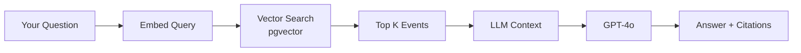

# RAG Chatbot Guide

**Note**: This feature is planned for Phase 6. This guide describes the future functionality.

## Overview

The AGI Tracker RAG (Retrieval-Augmented Generation) chatbot lets you ask natural language questions about AI progress and get grounded, cited answers based on our evidence database.

**Example queries**:
- "What's the latest on SWE-bench progress?"
- "Which labs are leading in computer use benchmarks?"
- "Has anyone hit 70% on GPQA Diamond yet?"
- "Compare GPT-5 vs Claude 3.5 on coding tasks"

Access at: http://localhost:3000/chat (when implemented)

## How It Works

### RAG Architecture



1. **Query embedding**: Your question → vector representation
2. **Semantic search**: Find relevant events in database
3. **Context assembly**: Top 5-10 events + signpost data
4. **LLM generation**: GPT-4o generates answer
5. **Citation**: Every claim linked to source event

### Grounded Responses

Unlike general chatbots, the AGI Tracker chatbot:

✅ **Only uses events in database** (no hallucinations)  
✅ **Cites sources** (every claim has event ID + URL)  
✅ **Respects evidence tiers** (prioritizes A/B tier)  
✅ **Says "I don't know"** (when data missing)  
✅ **Shows confidence** (based on tier quality)

## Using the Chatbot

### Asking Questions

**Good questions**:
- Specific: "What's the best SWE-bench score in October 2025?"
- Comparative: "Which model leads on GPQA Diamond?"
- Temporal: "How has OSWorld progress changed since June?"
- Explanatory: "Why does SWE-bench matter for AGI?"

**Bad questions**:
- Too broad: "Tell me about AI" (use docs instead)
- Speculative: "When will AGI arrive?" (chatbot doesn't forecast)
- Out-of-scope: "How do I train a model?" (not our domain)
- Personal: "What should I invest in?" (no financial advice)

### Understanding Responses

#### Answer Structure

```markdown
**Answer**: GPT-5 achieved 85% on SWE-bench Verified as of October 2025. [1]

This is the current state-of-the-art, surpassing Claude 3.5 Sonnet's 60%. [2]

**Citations**:
[1] "GPT-5 Achieves 85% on SWE-bench Verified" (A-tier, 2025-10-15)
    https://openai.com/research/gpt-5-swebench
[2] "Claude 3.5 Sonnet Reaches 60%" (B-tier, 2025-08-10)
    https://anthropic.com/claude-3.5
```

#### Confidence Indicators

The chatbot includes confidence based on evidence quality:

| Phrase | Meaning |
|--------|---------|
| **"According to peer-reviewed research..."** | A-tier evidence (high confidence) |
| **"Official lab announcements report..."** | B-tier evidence (moderate confidence) |
| **"Press coverage suggests..."** | C-tier evidence (low confidence, flagged as unverified) |
| **"I don't have verified data on..."** | No A/B tier evidence found |

#### Out-of-Scope Detection

Chatbot detects and deflects inappropriate questions:

**User**: "Should I buy NVIDIA stock?"

**Bot**: "I don't provide financial advice. I can help you understand AI progress metrics and benchmarks. Would you like to know about recent developments in training compute or datacenter expansion instead?"

## Advanced Features

### Multi-Turn Conversations

Chatbot maintains context across turns:

```
User: What's the latest on SWE-bench?
Bot: GPT-5 achieved 85% as of October 2025. [1]

User: How does that compare to last year?
Bot: In October 2024, the best score was 43.8% (GPT-4). [2] 
     That's a 41.2 percentage point gain in 12 months.

[1] ...
[2] ...
```

### Follow-Up Suggestions

After answering, chatbot suggests related queries:

```
✅ Answered

You might also ask:
- "What's next for SWE-bench? (90% threshold)"
- "Which other coding benchmarks exist?"
- "Compare SWE-bench with HumanEval"
```

### Export Conversations

Save chat history for later reference:

1. Click **Export Chat**
2. Get markdown file with Q&A + citations
3. Use in research notes or reports

**Example export**:
```markdown
# Chat Export - 2025-10-29

## Q: What's the latest on SWE-bench?
**A**: GPT-5 achieved 85% on SWE-bench Verified...

### Citations
[1] "GPT-5 Achieves 85%..." (A-tier, 2025-10-15)
```

## Best Practices

### For Researchers

✅ **Do**:
- Ask specific, scoped questions
- Request citations (default, but verify)
- Cross-check A-tier sources
- Export chats for reproducibility

❌ **Don't**:
- Trust C/D tier without verification
- Assume chatbot forecasts (it doesn't)
- Use for financial or career advice
- Expect real-time data (updates daily)

### For General Users

✅ **Do**:
- Start with simple questions
- Follow suggested queries
- Read cited sources
- Check evidence tier badges

❌ **Don't**:
- Share unverified C-tier as fact
- Ignore confidence indicators
- Expect legal/financial advice

## Limitations

### What the Chatbot CAN'T Do

❌ **Forecast**: No timeline predictions (use expert predictions page)  
❌ **Recommend**: No investment/career advice  
❌ **Debate**: No opinion on whether AGI is good/bad  
❌ **Real-time**: Data refreshes daily, not live  
❌ **Analyze**: Can't run custom queries on raw data (use API)

### Known Issues (To Be Fixed)

- **Hallucination risk**: Rare but possible (always check citations)
- **Recency bias**: Emphasizes recent events over older
- **Jargon**: Sometimes uses technical terms (ask for clarification)
- **Ambiguity**: Struggles with vague questions

## Troubleshooting

### "I don't have data on that"

**Cause**: No A/B tier evidence in database

**Try**:
- Rephrase question
- Check Events Feed manually
- Ask about related signposts
- Try broader query

### Chatbot Gives Wrong Answer

**Cause**: Misinterpreted query or poor retrieval

**Action**:
1. Check citations (verify sources)
2. Report issue with thumbs-down button
3. Rephrase question for clarity
4. Fall back to manual search

### Citations Missing

**Cause**: Bug or streaming error

**Action**:
- Refresh page
- Ask again
- Report bug on GitHub

## Privacy & Security

### Data Collection

**What we collect**:
- Questions asked (for improving retrieval)
- Thumbs up/down feedback
- Chat length and duration

**What we DON'T collect**:
- Personal identifiable information
- IP addresses (anonymized)
- Browsing history
- User accounts (no login required)

### LLM Privacy

**GPT-4o API**:
- OpenAI does NOT train on our API data (enterprise agreement)
- Conversations not shared with third parties
- Logs retained 30 days max (OpenAI policy)

**Local deployment**:
- Use local LLM (Llama, Mixtral) for full privacy
- Configure in environment: `LLM_PROVIDER=local`

## Future Enhancements

Planned for Phase 6+:

### Multi-Model Consensus

Ask same question to multiple models (GPT-4, Claude, Gemini):

```
User: "What's the best SWE-bench score?"

GPT-4:  85% (GPT-5)
Claude: 85% (GPT-5)
Gemini: 85% (GPT-5)

Consensus: ✅ High agreement
```

Reduces hallucination risk.

### Voice Interface

- Speak questions instead of typing
- Hear answers read aloud
- Mobile-friendly

### Custom Data Sources

- Upload your own papers
- Add private benchmarks
- Combine with AGI Tracker data

## API Access

For programmatic chatbot use:

```bash
curl -X POST "http://localhost:8000/v1/chat" \
  -H "Content-Type: application/json" \
  -d '{
    "query": "What is the latest on SWE-bench?",
    "conversation_id": "optional-session-id"
  }'
```

Response:
```json
{
  "answer": "GPT-5 achieved 85% on SWE-bench Verified...",
  "citations": [
    {
      "event_id": 123,
      "title": "GPT-5 Achieves 85%...",
      "tier": "A",
      "url": "https://..."
    }
  ],
  "confidence": 0.95,
  "sources_used": 3
}
```

## Next Steps

- [Scenario Explorer](/docs/guides/scenario-explorer) - What-if analysis
- [API Usage](/docs/guides/api-usage) - Build custom interfaces
- [Events Feed](/docs/guides/events-feed) - Browse raw evidence

---

**Status**: Planned for Phase 6 (not yet implemented)

**Follow development**: [GitHub Project Board](https://github.com/hankthevc/AGITracker/projects)

